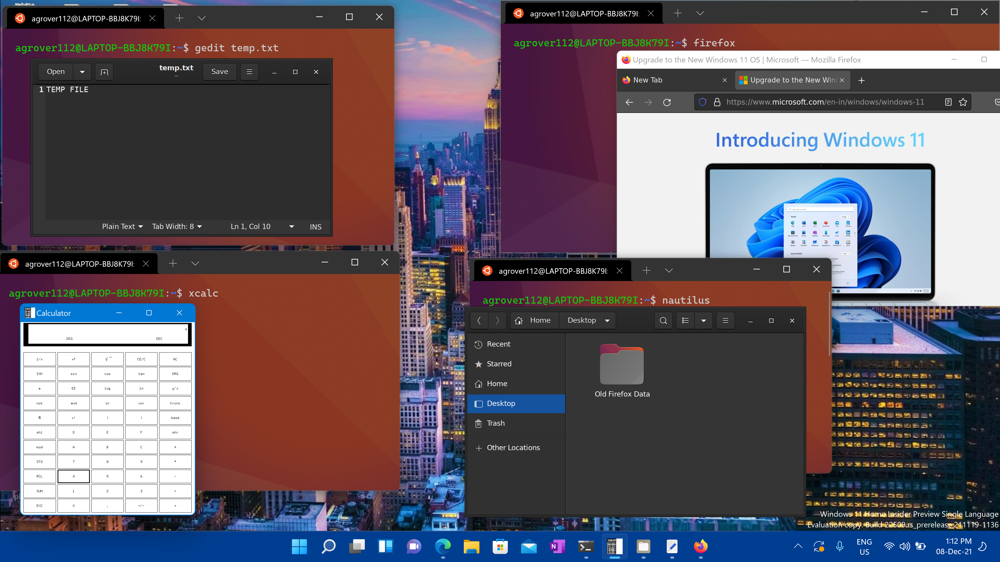
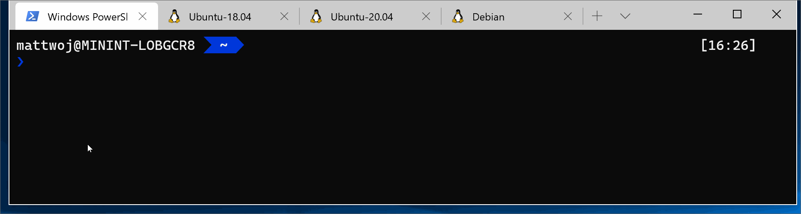

<p align="center">
  
</p>

# Windows dev environment setup

## 🚀 Overview

Setting up a development environment on Windows can be a challenging task, but with the right tools and guidance, it can be made easier. This guide will provide step-by-step instructions for setting up a development environment on Windows, including installing WSL, Terminal, Git, and Visual Studio Code Insider.

## Prerequisites:

Before beginning the setup process, ensure that your system meets the following requirements:

- Windows 10 version 1903 or higher
- Administrator access to your machine
- An internet connection

---

# 🐧 WSL: The Heart of Your Windows Dev Environment

To set up your Windows development environment, the first and most vital step is installing the Windows Subsystem for Linux (WSL). 🚀
## 💻 Installing WSL 2: A Breeze

WSL 2 is the latest version, featuring a full Linux kernel and complete system call compatibility. No longer requiring multiple steps, all you need to do is execute this single command in PowerShell or Command Prompt:

```sh
wsl --install
```

This command accomplishes the following:

- Enables the optional WSL and Virtual Machine Platform components
- Downloads and installs the latest Linux kernel
- Sets WSL 2 as the default
- Downloads and installs the Ubuntu Linux distribution (a reboot may be required)

Should you wish to change your default Linux distribution, follow the provided [documentation](https://docs.microsoft.com/en-us/windows/wsl/install#change-the-default-Linux-distribution-installed). 📚

With WSL at your disposal, the Windows development landscape becomes yours to conquer! 💪🌟

**Installing WSL through the store will allow you to get the latest WSL updates and features faster, and without needing to modify your Windows version.**

[](https://www.microsoft.com/store/productId/9P9TQF7MRM4R)

## 🔧 **Setting Up Linux User & Password:**

🔒 After installing your Linux distribution with WSL, launch it from the Start menu. You'll create a unique User Name and Password during the initial run.

💡 These credentials are specific to each Linux distribution and don't relate to your Windows user.

⚠️ Password entry is blind typing, normal behavior, nothing will show on the screen.

👤 Your account becomes the default user and auto-signs in on launch.

📝 Each WSL distribution has its own set of user accounts. Configuring a new account is necessary when adding, reinstalling, or resetting.

## 📦 **Update & Upgrade Packages:**

To keep your system shipshape, regularly update and upgrade packages with your distribution's preferred package manager. For Ubuntu or Debian, execute:

```bash
sudo apt update && sudo apt upgrade
```

⚙️ Windows won't auto-update or upgrade your Linux distribution(s). Linux users typically prefer controlling this task themselves.

## Restarting WSL

If WSL stops working, you can restart it with these two commands from PowerShell/Command Prompt:

```sh
wsl.exe --shutdown
wsl.exe
```

## 🖥️ **Run Linux GUI Apps**



From your Linux terminal, use these commands to download and install popular Linux applications. Remember, if your distribution isn't Ubuntu, the package manager may vary from apt. Once installed, access the app through the Start menu under your distribution name. For instance, Ubuntu -> Microsoft Edge.

For more info check [Linux GUI Apps](https://learn.microsoft.com/en-us/windows/wsl/tutorials/gui-apps?source=recommendations).

### 🖋️ **Install Gnome Text Editor**

Gnome Text Editor, the default text editor of the GNOME desktop environment, can be installed with a simple command:

```bash
sudo apt install gnome-text-editor -y

# To launch your bashrc file in the editor, enter:
gnome-text-editor ~/.bashrc
```

> 📝 Note: GNOME Text Editor takes over as GNOME/Ubuntu's default text editor in Ubuntu 22.10, replacing gedit. If you're using an older version of Ubuntu and prefer gedit, the previous default text editor, use this command:

### 🖌️ Install GIMP

GIMP, the free and open-source raster graphics editor, empowers you with image manipulation, free-form drawing, transcoding between various image formats, and more. To install GIMP, execute:

```bash
sudo apt install gimp -y

# To launch GIMP, simply type:
gimp
```

### 🗂️ Install Nautilus

Nautilus, also known as GNOME Files, serves as the file manager for the GNOME desktop environment (akin to Windows File Explorer). To install Nautilus, use:

```bash
sudo apt install nautilus -y

# Launch Nautilus by entering:
nautilus
```

### 📺 Install VLC

VLC, the free and open-source multimedia player and framework, handles most multimedia files with ease. To get VLC, run:

```bash
sudo apt install vlc -y

# Launch VLC by typing:
vlc
```

### 💻 Install X11 Apps

The Linux windowing system, X11, comes with a collection of miscellaneous apps and tools like xclock, xcalc calculator, xclipboard for cut and paste, xev for event testing, and more. For installation:

```bash
sudo apt install x11-apps -y

# To launch a specific tool, simply enter its name, for example:
xcalc
xclock
xeyes
```

---

# 📄 **Set Up Version Management with Git**

Discover the power of 🔗 [Git version control system](https://example.com/git-setup-guide) on WSL! 🚀



## 💻🚀 **Installing Git**

Git often comes pre-installed with most Windows Subsystem for Linux distributions. However, to ensure you have the latest version, consider updating it. Don't forget to set up your git config file.

📥 To install Git, visit the Git Download for Linux site. Each Linux distribution has its unique package manager and install command.

👉 For the latest stable Git version on Ubuntu/Debian, run:

```bash
sudo apt-get install git
```

> 📝 Note: If you haven't already, you may want to [install Git for Windows](https://git-scm.com/download/win) too. 🎉

## 📝 Git Config (windows and in wsl)

### Name

To set up your Git config file, open a WSL command line and set your name with this command (replacing "Your Name" with your preferred username):

```sh
git config --global user.name "Your Name"
```

### Email

Set your email with this command (replacing "youremail@domain.com" with the email you prefer):

```sh
git config --global user.email "youremail@domain.com"
```

### Username

Finally, add your GitHub username to link it to git (case sensitive!):

```sh
git config --global user.username "GitHub username"
```

> ⚠️ You can double-check any of your settings by typing `git config --list`. To make any changes, just type the necessary command again as in the examples above.

## 😺 GitHub Credentials


### 🔑💻 **Sharing Credentials & Settings with Git for Windows**

To seamlessly share credentials and settings between WSL and the Windows host, it's best to install the [latest Git for Windows](https://github.com/git-for-windows/git/releases/latest). The installation includes Git Credential Manager (GCM), with each new release containing the latest version. During installation, GCM is set as the default credential helper.

⚠️ If you have reasons to avoid installing Git for Windows, you can directly install GCM as a Linux application within your WSL distribution. However, keep in mind that this setup means GCM will run as a Linux application and won't utilize the authentication or credential storage features of the host Windows operating system. For instructions on [configuring WSL without Git for Windows](https://github.com/GitCredentialManager/git-credential-manager/blob/main/docs/wsl.md#configuring-wsl-without-git-for-windows), refer to the GCM repository.

To set up GCM for use with a WSL distribution, open your distribution and enter this command:

```bash
git config --global credential.helper "/mnt/c/Program\ Files/Git/mingw64/bin/git-credential-manager.exe"
```

### 🔏 **Signing Commits with GPG Key**

Local Git configuration allows us to sign commits using a GPG key. Once signed, GitHub marks those commits as verified, giving others confidence that the changes originate from a trusted source.

### 🚀 **Installing Required Programs**

To get started, we need to [install Gpg4Win. 📥](https://gnupg.org/download/#binary)

### 🔑🚀 **Generate a GPG Key**

> If you installed gnupg using Winget or Chocolatey from the command line, remember to restart the console or refresh the environment variables.

🖥️ Open a Windows PowerShell command window.

Run this command to generate the GPG key:

```bash
gpg --full-generate-key
```

It will prompt for specific details, use the following:

- Kind: RSA & RSA.
- Key Size: 4096 bits.
- Expiration: 0 (Never expires).
- Real Name: Use your GitHub Username.
- Email: Use your GitHub email; this will be the alias of the GPG key.
- Comment: You can leave this empty.

### 🛠️ **Configure Git for Windows**

🖥️ Open a Windows PowerShell command window.

```bash
# 1.First locate where gnupg is installed and save it into a variable:
$gnupgPath = where.exe gpg

# 2.Configure Git to use gnupg as GPG program:
git config --global gpg.program $gnupgPath

# 3.Configure Git to sign all commits by default:
git config --global commit.gpgsign true

# 4.Configure Git to use your GPG key as signing key
git config --global user.signingkey "Use the alias of the GPG key here"

# 5.Optional: Configure Git to sign all tags by default:
git config --global tag.gpgsign true
```

### 💻🐧 **Configure Git for WSL (Windows Subsystem for Linux)**

🖥️ Open a Windows PowerShell command window.

```bash
# 1.First locate where gnupg is installed and save it into a variable:
$gnupgPath = where.exe gpg

# 2.Translate the path to WSL:
$gnupgWslPath = wsl wslpath $gnupgPath

# 3.Configure Git to use gnupg as GPG program:
wsl git config --global gpg.program $gnupgWslPath

# 4.Configure Git to sign all commits by default:
wsl git config --global commit.gpgsign true

# 5.Configure Git to use your GPG key as signing key
wsl git config --global user.signingkey "Use the alias of the GPG key here"

# 6.Optional: Configure Git to sign all tags by default:
wsl git config --global tag.gpgsign true
```

### 🔑🔧 **Configure the GPG Key in GitHub**

1. **Export the Key**

To export the GPG key, use the following command:

```bash
gpg --armor --export "Use the alias of the GPG key here"
```

2. **Add GPG Key on GitHub**

Now, open the GitHub page to add the GPG key:

🌐 [GitHub Add GPG Key](https://github.com/settings/gpg/new)

---

# ⌨️ **Set Up Windows Terminal: Power Up Your Command Line**


Windows Terminal unleashes the potential of any application with a command line interface.

🐧 Whenever a new WSL Linux distribution is installed, Windows Terminal conjures a dedicated instance that you can fine-tune to your liking.

💡Head to the Windows Terminal docs for setup and personalization assistance. Customize:

1. Installation: Get it from the Microsoft Store - [Windows Terminal or Windows Terminal (Preview)](https://learn.microsoft.com/en-us/windows/terminal/get-started).
2. Custom Actions: [Set up keyboard shortcuts that suit your natural workflow](https://learn.microsoft.com/en-us/windows/terminal/#custom-actions).
3. Default Startup Profile: Configure your preferred starting setup.
   1. Select the `˅` icon from Windows Terminal and go to the Settings menu
   2. Startup section find the Default profile dropdown, select Ubuntu and Windows Terminal as the Default terminal
4. Starting Directory
   1. Under the Profiles section in the settings menu click on Ubuntu
   2. At the General tab, you will find a Starting directory input
   3. Enter the following replacing "username" with your Ubuntu user name: `\\wsl$\Ubuntu\home\username`
   4. You can leave the `Use parent process directory` box unchecked
   5. If it is still opening into your `/` directory, change the `Command line` setting located right above the `Starting directory` input box to the following: `wsl.exe -d Ubuntu`
5. Appearance: Tailor [themes](https://learn.microsoft.com/en-us/windows/terminal/customize-settings/appearance#theme), [color schemes](https://learn.microsoft.com/en-us/windows/terminal/customize-settings/color-schemes), [names, starting directories](https://learn.microsoft.com/en-us/windows/terminal/customize-settings/profile-general), [background images](https://learn.microsoft.com/en-us/windows/terminal/customize-settings/profile-appearance#background-image), and more...
6. Set up a custom prompt for [PowerShell or WSL with Oh My Posh](https://learn.microsoft.com/en-us/windows/terminal/tutorials/custom-prompt-setup).

   [](https://apps.microsoft.com/store/detail/XP8K0HKJFRXGCK)

---

# 💤 Zsh - Embrace the Power!

Z shell, also known as Zsh, works almost identically to the standard BASH shell found on default Linux installs. But what makes it stand out are its incredible support for plugins and themes, along with cool features like spelling correction and recursive path expansion. It's time to leave BASH behind and unlock the full potential of Zsh! 💪😎

## 🚀 Installing Zsh

To install Zsh, execute this command:

```bash
sudo apt install zsh
```

Once installed, type `zsh` in the terminal. Zsh will prompt you to choose some configurations. Don't worry; we'll handle this later while installing oh-my-zsh. For now, select option `0` to create the config file and prevent this message from showing again. 🛠️👉 0️⃣

## 🔥 OhMyZsh - The Ultimate Zsh Experience!

The most popular plugin framework by far is [OhMyZsh](https://ohmyz.sh/). It comes preloaded with a plethora of plugins, themes, helpers, and more. Not only does it enhance productivity, but it also adds a touch of coolness to your terminal. 😍🔌💻

## 🌐 cURL - Essential for Downloads

Before we proceed, ensure you have [cURL](https://curl.se/) installed. It's a fantastic way to transfer data from the command line, and that's how we'll download OhMyZsh.

```bash
sudo apt install curl
```

## ⚙️ Installing OhMyZsh - Your Personal Assistant

Enter the following command into your terminal to install OhMyZsh:

```bash
sh -c "$(curl -fsSL https://raw.github.com/ohmyzsh/ohmyzsh/master/tools/install.sh)"
```

Great! Now you should see a `.oh-my-zsh` directory inside your home directory. To customize plugins and themes, edit your `.zshrc` file, also found in your home directory.

Here is a list of all the [themes](https://github.com/ohmyzsh/ohmyzsh/wiki/Themes) and [plugins](https://github.com/ohmyzsh/ohmyzsh/wiki/Plugins) bundled with OhMyZsh. 💼🎨🔌

## 🔌 More Plugins - Enhance Your Zsh Experience

While there are countless plugins available, here are two highly recommended ones:

### 🚀 [zsh-autosuggestions](https://github.com/zsh-users/zsh-autosuggestions)

This plugin provides autosuggestions for zsh, suggesting commands as you type based on history and completions.

1. Clone this repository into `$ZSH_CUSTOM/plugins` (by default `~/.oh-my-zsh/custom/plugins`):

```bash
git clone https://github.com/zsh-users/zsh-autosuggestions ${ZSH_CUSTOM:-~/.oh-my-zsh/custom}/plugins/zsh-autosuggestions
```

2. Add the plugin to the list of plugins for Oh My Zsh to load (inside `~/.zshrc`):

```bash
plugins=(git zsh-autosuggestions)
```

3. Start a new terminal session. 🚀🎛️

### 🌈 [zsh-syntax-highlighting](https://github.com/zsh-users/zsh-syntax-highlighting)

This package provides syntax highlighting for the zsh shell, highlighting commands as they are typed in an interactive terminal. It helps in reviewing commands before running them, particularly in catching syntax errors.

1. Clone this repository into oh-my-zsh's plugins directory:

```bash
git clone https://github.com/zsh-users/zsh-syntax-highlighting.git ${ZSH_CUSTOM:-~/.oh-my-zsh/custom}/plugins/zsh-syntax-highlighting
```

2. Activate the plugin in `~/.zshrc`:

```bash
plugins=(git zsh-autosuggestions zsh-syntax-highlighting)
```

3. Start a new terminal session. 🌈🌟

For a vast list of plugins, check out the [awesome zsh plugins repository](https://github.com/unixorn/awesome-zsh-plugins). 🛠️🔌🌟

## 🎨 Oh My Posh - Supercharge Your Linux Terminal Prompt


Oh My Posh is a delightful framework that enhances your Linux terminal prompt and makes it not only more informative but also visually appealing. Customize and transform your prompt into something that matches your style and productivity needs. 🌟🚀

## 🚀 Installing Oh My Posh

1. Install

```bash
# Using Homebrew
brew install jandedobbeleer/oh-my-posh/oh-my-posh

# Manual
curl -s https://ohmyposh.dev/install.sh | bash -s
```

2. Activate the plugin in `~/.zshrc`:

```bash
# Oh My Posh init Theme
eval "$(oh-my-posh init zsh --config ~/.poshthemes/jandedobbeleer.omp.json)"
```

3. Start a new terminal session. 🌈🌟

Next, you'll need to [install and set up a suitable font](https://ohmyposh.dev/docs/installation/fonts) to display the special characters used by Oh My Posh.

That's it! Your Linux terminal prompt should now be enhanced with the beautiful and informative Oh My Posh theme. Customize further by exploring the various options available in the theme settings. ✨🎨

For more information and advanced customization, check out the official [Oh My Posh documentation](https://ohmyposh.dev/docs) and unleash the full potential of your Linux terminal prompt! 💻🔥

---

# 🍺 Homebrew - The Missing Package Manager for Linux

Homebrew is a popular package manager for macOS, and now it's available for Linux too! With Homebrew, you can easily install, update, and manage various packages and applications on your Linux system.

## 🚀 Installing Homebrew

To install Homebrew on Linux, follow these steps:

1. Open a terminal window.

2. Install Homebrew using the following command:

```bash
/bin/bash -c "$(curl -fsSL https://raw.githubusercontent.com/Homebrew/install/HEAD/install.sh)"
```

That's it! Enjoy using Homebrew to simplify package management on your Linux system. 🍺🚀

---

# 💡 Microsoft PowerToys - Enhance Windows Experience


Microsoft PowerToys is a set of handy utilities for Windows, boosting productivity and improving multitasking. It includes features like window management, keyboard shortcuts, color picker, image resizer, and more.

## 🚀 Installing Microsoft PowerToys

You can install Microsoft PowerToys using multiple methods:

- **Winget**: Open a terminal and run:

```sh
winget install Microsoft.PowerToys --source winget
```

- **Microsoft Store**: Search for ["Microsoft PowerToys"](https://aka.ms/getPowertoys) in the Microsoft Store and install it from there.

- **GitHub**: Visit the official [PowerToys GitHub](https://github.com/microsoft/PowerToys) page, download the latest release installer, and follow the installation wizard.

## 🛠️ Using Microsoft PowerToys

Access PowerToys Settings from the Start menu or system tray to enable, disable, and customize utilities.

## 🎯 Notable PowerToys Utilities

- **FancyZones**: Organize windows into custom layouts for better multitasking.

- **Shortcut Guide**: Display helpful keyboard shortcuts overlay.

- **PowerRename**: Batch rename files with advanced search and replace.

- **Color Picker**: Easily pick colors from your screen.

- **Image Resizer**: Resize images from File Explorer.

- **File Explorer Preview Pane**: Preview files directly in File Explorer.

---

# 📝💻 **Set Up Your Favorite Code Editor**

👉 Recommended Visual Studio Code Insiders for seamless remote development and debugging with WSL.

🚀 **Use Visual Studio Code Insiders:**

Follow these steps to get started:

1. Install [Visual Studio Code insiders](https://code.visualstudio.com/insiders/).
2. Get the [Remote Development extension pack for WSL](https://marketplace.visualstudio.com/items?itemName=ms-vscode-remote.vscode-remote-extensionpack).
3. [Follow this step-by-step guide to Get started using Visual Studio Code with WSL](https://learn.microsoft.com/en-us/windows/wsl/tutorials/wsl-vscode).


Once set up, open your WSL project with a VS Code remote server:

```bash
code-insiders .
```

Don't forget the period at the end to open the current directory. 💫💡

💡 **Note:**

> When using Remote - WSL, you must install any VS Code extensions you need separately. Extensions that are already installed locally on VS Code won't be automatically available in the WSL environment. To [Learn more](https://code.visualstudio.com/docs/remote/wsl#_managing-extensions), refer to the documentation.

## Changing the Default Shell

The WSL2 shell can be chosen as the default VS Code terminal by pressing `Ctrl` + `Shift` + `P` and typing/choosing Terminal: Select Default Profile, then selecting zsh:
   

   


---

# 🐳 Set up Remote Development Containers with Docker

Docker enables you to set up remote development containers effortlessly. Follow this [step-by-step guide to get started with Docker remote containers on WSL 2](https://learn.microsoft.com/en-us/windows/wsl/tutorials/wsl-containers) and connect your project to a remote development container using Docker Desktop for Windows.

## 🚀 Get Started with Docker Remote Containers on WSL 2

1. **Install Docker Desktop for Windows**: Download and install [Docker Desktop from the official Docker website.](https://docs.docker.com/docker-for-windows/wsl/#download)

2. **Configure Docker for WSL 2**: Open Docker Desktop settings and enable the "Use the WSL 2 based engine" option under the "General" section.

   

   

   

4. **Connect to WSL 2**: Open a terminal in your Linux distribution running on WSL 2 and ensure you can run Docker commands without any issues.
  
  ```bash
  # Display the version and build number by entering:
  docker --version
  # Test that your installation works correctly by running a simple built-in Docker image using:
  docker run hello-world
  ```

## 🔄 Use Docker Desktop to Manage Remote Containers

With Docker Desktop for Windows, you can conveniently manage and switch between different remote development containers directly from the Docker interface.

Now you're all set to enjoy the power of remote development with Docker containers! Happy coding! 🚀💻

## ⚙️ Develop in Remote Containers with VS Code

Develop apps using Docker with ease and efficiency using VS Code and essential extensions: WSL, Dev Containers, and Docker. 👩‍💻🐳

1. [**Install VS Code WSL Extension**:](https://marketplace.visualstudio.com/items?itemName=ms-vscode-remote.remote-wsl) Seamlessly open Linux projects running on WSL in VS Code, eliminating pathing issues and cross-OS challenges.

2. [**Install VS Code Dev Containers Extension**:](https://marketplace.visualstudio.com/items?itemName=ms-vscode-remote.remote-containers) Work inside a container for your project folder or repository, utilizing VS Code's full power.

3. [**Install VS Code Docker Extension**:](https://marketplace.visualstudio.com/items?itemName=ms-azuretools.vscode-docker) Manage containerized applications directly from VS Code. Pair with Dev Containers for a smooth development environment. 🏗️

## 🚀 Working with Git?

Consider these essential tips:

1. **Consistent Line Endings**: When working with the same repository locally in Windows and inside a container, ensure consistent line endings for smooth collaboration. Check out our [tips and tricks](https://code.visualstudio.com/docs/remote/troubleshooting#_resolving-git-line-ending-issues-in-wsl-resulting-in-many-modified-files) for details.

   Adding the following to .gitattributes file to the root of your repository:

```bash
  * text=auto eol=lf
  *.{cmd,[cC][mM][dD]} text eol=crlf
  *.{bat,[bB][aA][tT]} text eol=crlf
  ```

3. **Seamless Git Credentials**: If you clone using a Git credential manager, your container will have access to your credentials automatically! For SSH keys, you can also opt-in to [sharing them](https://code.visualstudio.com/remote/advancedcontainers/sharing-git-credentials). Find more about Sharing Git credentials with your container.

### 🔐 **Sharing GPG Keys** (Optional)
If you want to GPG sign your commits, you can share your local keys with your container as well. You can find out about signing using a GPG key in [GitHub's documentation.](https://docs.github.com/authentication/managing-commit-signature-verification)

If you do not have GPG set up, you can configure it for your platform:

- On WSL:
  - Install [Gpg4win](https://www.gpg4win.org/) on the Windows side.
  - Install `gpg` in your WSL distro. `sudo apt install gpg`
  - Register a `pinentry` GUI in your WSL distro. `echo pinentry-program /mnt/c/Program\ Files\ \(x86\)/Gpg4win/bin/pinentry.exe > ~/.gnupg/gpg-agent.conf`
  - Reload the gpg agent in WSL. `gpg-connect-agent reloadagent /bye`
 
> 📝 Note: For Windows user, the gpg signing key must be configured using the Windows GUI or CLI (powershell/cmd) and not in Git Bash. A Dev Container can't access the gpg keys set in Git Bash even though it is in your ~/.gnupg/ folder, accessible in the Windows Explorer.
 
Next, install gnupg2 in your container by updating your `Dockerfile`.

```dockerfile
RUN apt-get update && apt-get install gnupg2 -y
```

Or if running as a non-root user:

```dockerfile
RUN sudo apt-get update && sudo apt-get install gnupg2 -y
```

<sub>Make sure you have Docker Desktop installed and properly configured on your Windows machine to follow this guide successfully. Remote development containers provide a convenient and consistent development environment across different machines and platforms, enhancing productivity and collaboration.</sub>

---

<p align="center">
  
</p>
